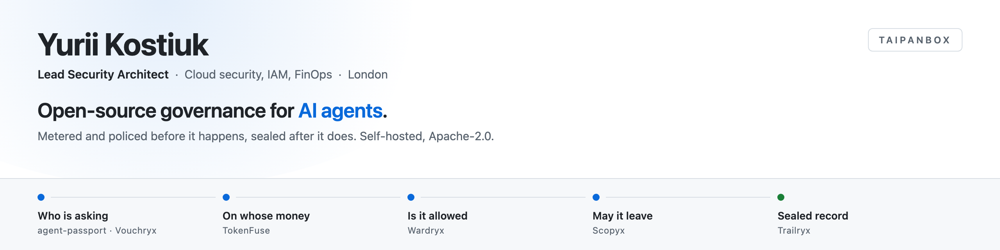
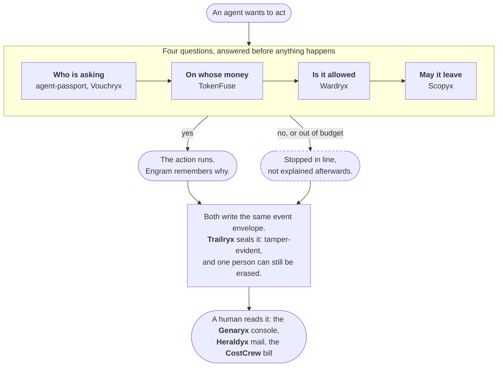

<picture>
  <source media="(prefers-color-scheme: dark)" srcset="banner-dark.png">
  
</picture>

  <a href="https://it-rat.com"><b>it-rat.com</b></a> &nbsp;·&nbsp;
  <a href="https://www.linkedin.com/in/yurii-kostiuk-778900ab/">LinkedIn</a> &nbsp;·&nbsp;
  <a href="mailto:yukosemail@gmail.com">Email</a> &nbsp;·&nbsp;
  <a href="https://github.com/TAIPANBOX?tab=repositories">All repositories</a>

> **A new hire gets a contract, a budget, a badge and a manager. An AI agent usually gets an admin key and a prayer.**

I build the services that close that gap, and I run them on real infrastructure before I write a word about them. Install the one that solves your problem today, not a platform: they share one agent identity and one event envelope, so any two of them already understand each other. Free and open source, Apache-2.0, self-hosted, no seats.

<picture>
  <source media="(prefers-color-scheme: dark)" srcset="control-room-dark.svg">
  
</picture>

<b>An illustration, not a live feed.</b> The numbers are invented, the behaviour is not. An agent here is stopped four different ways and only one of them is money: a risky action refused after it touched untrusted data, a detected loop, a policy decision, and the budget breaker. The kernel band is Idryx's eBPF program on the <code>sys_enter_connect</code> tracepoint, which I have run: Linux only, it reads no payloads, and it reports rather than blocks.

### The services

<table>
<tr><td nowrap><b>Money</b></td><td><a href="https://github.com/TAIPANBOX/tokenfuse"><b>TokenFuse</b></a> the in-line kill switch: budget, loop detection, and risky actions blocked after untrusted data &nbsp;·&nbsp; <a href="https://github.com/TAIPANBOX/costcrew"><b>CostCrew</b></a> a crew of agents takes the cloud bill apart, a person signs it off</td></tr>
<tr><td nowrap><b>Policy</b></td><td><a href="https://github.com/TAIPANBOX/wardryx"><b>Wardryx</b></a> policy decisions with a human in the loop &nbsp;·&nbsp; <a href="https://github.com/TAIPANBOX/scopyx"><b>Scopyx</b></a> agents reach the web through a decision, not around one</td></tr>
<tr><td nowrap><b>Identity</b></td><td><a href="https://github.com/TAIPANBOX/agent-passport"><b>agent-passport</b></a> one id, one delegation chain, one envelope &nbsp;·&nbsp; <a href="https://github.com/TAIPANBOX/vouchryx"><b>Vouchryx</b></a> a delegation an agent can prove and a person can end &nbsp;·&nbsp; <a href="https://github.com/TAIPANBOX/idryx"><b>Idryx</b></a> one graph for humans, keys and agents, and a Linux eBPF sensor for the ones nobody registered</td></tr>
<tr><td nowrap><b>Memory</b></td><td><a href="https://github.com/TAIPANBOX/engram"><b>Engram</b></a> the SQLite of agent memory: embeddable, MCP-native, bitemporal</td></tr>
<tr><td nowrap><b>Quality</b></td><td><a href="https://github.com/TAIPANBOX/verdryx"><b>Verdryx</b></a> cost per correctly resolved case, not per token &nbsp;·&nbsp; <a href="https://github.com/TAIPANBOX/mockryx"><b>Mockryx</b></a> fire drills that prove guardrails hold</td></tr>
<tr><td nowrap><b>Evidence</b></td><td><a href="https://github.com/TAIPANBOX/trailryx"><b>Trailryx</b></a> a record nobody can quietly change or shorten &nbsp;·&nbsp; <a href="https://github.com/TAIPANBOX/qryx"><b>Qryx</b></a> cryptography inventory and post-quantum risk</td></tr>
<tr><td nowrap><b>Operate</b></td><td><a href="https://github.com/TAIPANBOX/genaryx"><b>Genaryx</b></a> the console &nbsp;·&nbsp; <a href="https://github.com/TAIPANBOX/heraldyx"><b>Heraldyx</b></a> alerts with a link and never a button &nbsp;·&nbsp; <a href="https://github.com/TAIPANBOX/taipan"><b>taipan</b></a> one command</td></tr>
</table>

**Start here:** [stack-up](https://github.com/TAIPANBOX/stack-up) on your laptop, no Docker &nbsp;·&nbsp; [stack-single](https://github.com/TAIPANBOX/stack-single) on one box &nbsp;·&nbsp; [stack-k8s](https://github.com/TAIPANBOX/stack-k8s) on Kubernetes &nbsp;·&nbsp; [terraform-provider-taipan](https://github.com/TAIPANBOX/terraform-provider-taipan) as code

<b>How one agent action moves through it</b>

 

Around that line sit the checks that do not run inside it: **Mockryx** rehearses the guardrails before production, **Verdryx** scores the answers and watches for drift, **Idryx** maps who and what can do too much, **Qryx** keeps the cryptography inventory honest.

Thirteen services stay compatible because three small things are shared and gated, not agreed in a meeting: [agent-passport](https://github.com/TAIPANBOX/agent-passport) is the spec, [agent-stack-go](https://github.com/TAIPANBOX/agent-stack-go) is that spec as a Go module with cross-language vectors pinned, and [estate-gates](https://github.com/TAIPANBOX/estate-gates) runs the checks no single repository can run on itself, including the one that asks whether every gate can still go red.

<b>Nothing here is claimed, only measured</b>

 

- [**PROVEN.md**](https://github.com/TAIPANBOX/estate-gates/blob/main/PROVEN.md) records what has actually been executed: the date, the machine, and the artifact you can open. Runs that have not happened are listed too, with the gap named.
- The same stack has been brought up on **Hetzner, AWS and GCP**, and the traps that cost us the nights are written down in [stack-k8s](https://github.com/TAIPANBOX/stack-k8s) rather than quietly fixed.
- [**game-day-on-bedrock**](https://github.com/TAIPANBOX/game-day-on-bedrock) rehearses three Amazon Bedrock faults as a CI job, so the exit code is the whole result.
- Every number published on [it-rat.com](https://it-rat.com/what-is-proven.html) carries the command that measures it, and a tool that says when the page has fallen behind the repository.

Tagged releases:        

<b>Elsewhere on this profile</b>

 

- [**openwrt-mcp**](https://github.com/TAIPANBOX/openwrt-mcp) and [**hermes-openwrt**](https://github.com/TAIPANBOX/hermes-openwrt) put an MCP server on a home router: six tools over ubus, standing-policy authorisation, and config changes with an armed rollback timer.
- [**telegram-mcp-claude**](https://github.com/TAIPANBOX/telegram-mcp-claude) gives an assistant real Telegram tools: read, send, edit, pin, react, files.
- [**TokenFuse Pocket**](https://github.com/TAIPANBOX/tokenfuse-mobile) is the kill switch on a device the agent's host never touches. A side project, signed on-device, and not wired into the stack yet.
- [**sphere-ios**](https://github.com/TAIPANBOX/sphere-ios) is a personal one: twelve life spheres, on-device memory, SwiftUI.

### Say hello

Ask me about **Go, Rust, Kubernetes, cloud IAM and FinOps**, and about what actually breaks when an agent gets an API key. I am learning applied cryptography, which is how three of the services above ended up in Rust, and I am always interested in hard problems in agent security and governance.

**[yukosemail@gmail.com](mailto:yukosemail@gmail.com)** &nbsp;·&nbsp; **[LinkedIn](https://www.linkedin.com/in/yurii-kostiuk-778900ab/)** &nbsp;·&nbsp; **[X](https://twitter.com/yukostiuk)** &nbsp;·&nbsp; London, UK
